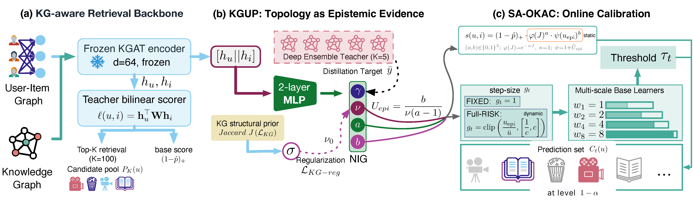

# From Pool-Conditioned Coverage to Deployment Validity in Conformal Recommendation: A Full-Catalog Evaluation Framework

[](#)
[](https://opensource.org/licenses/MIT)
[](https://www.python.org/)
[](https://pytorch.org/)

Official repository for the paper:

> **From Pool-Conditioned Coverage to Deployment Validity in Conformal Recommendation: A Full-Catalog Evaluation Framework**
>
> Xiaoyan Tian, Min Yu, Naihan Han, Zhihao Wang
>
> *Under review at Expert Systems with Applications*

<p align="center">
  
</p>

## Overview

This repository accompanies a **validity-accounting framework** for conformal prediction in **retrieve-then-calibrate** recommendation. Rather than proposing a method that improves a headline metric, the paper asks a measurement question: once a top-*K* retrieval stage is in place, **when does a knowledge-graph (KG) or uncertainty correction actually change the calibrated prediction set — and when is it inert?**

The framework reports **retrieval inclusion**, **within-pool conformal coverage**, and **end-to-end coverage** as *separate* quantities, and stratifies within-pool coverage along **deployment-observable** axes (user activity and item popularity).

## Key findings

Evaluated on three benchmarks (ML-1M, Last-FM, Amazon-Book) under a retrieve-then-calibrate protocol with three random seeds:

1. **Retrieval ceiling.** End-to-end coverage factorizes as `retrieval inclusion × within-pool coverage`; high within-pool coverage does **not** imply catalog-level coverage.
2. **Hidden conditional gaps.** Even when marginal within-pool coverage attains the nominal 1−α target, the worst deployment-observable slices fall **12–23 percentage points** below the marginal value.
3. **Near-inert corrections.** Post-top-*K* monotone multiplicative KG/uncertainty corrections become **near-inert**: under FIXED (split-conformal) calibration they change the prediction set only by perturbing the within-pool ranking enough to shift the calibrated cutoff. Three measurable diagnostics — **score-scale dominance**, **topology saturation**, and **rank immobility** — identify the regime (per-pool Spearman 0.965–0.992; prediction-set symmetric difference 0.016–0.071), which all three datasets occupy through two distinct mechanisms.
4. **Marginal-matched null control.** A dynamic uncertainty-modulated update's apparent worst-slice gain is reproduced by **re-tuning the baseline to the same marginal coverage** — i.e. movement along a shared coverage–size frontier, not targeted conditional correction.

## Evaluated pipeline

The framework instantiates a KG-aware conformal pipeline as the *vehicle* for testing whether KG signal moves the calibrated set:

| Component | Description |
|-----------|-------------|
| **KGUP** | KG-Evidential Uncertainty Probe — single-pass Normal-Inverse-Gamma head with KG structural priors |
| **SA-OKAC** | Strongly Adaptive Online KG-Aware Calibration — multi-scale online threshold update |
| **Nonconformity** | Topology-aware score `s = (1 − p̂) · φ(J) · ψ(u_epi)` |

The contribution of the paper is the **evaluation framework** and the **boundary characterization**, not a performance claim for these components.

## Repository contents

This repository provides the **experimental result files** (JSON) behind the paper's tables and figures, together with the framework figure:

```
results/
├── main/         # per-configuration metrics for each dataset and seed:
│                 #   retrieval inclusion @ K, within-pool coverage,
│                 #   end-to-end coverage, average prediction-set size
│                 #   (5 configurations × 3 datasets × 3 seeds)
└── stratified/   # per-slice within-pool coverage on the deployment-observable
                  #   axes (user activity, item popularity) and the KG-similarity
                  #   diagnostic axis, per dataset and seed
```

The five configurations are Vanilla-FIXED (SAOCP-style baseline), Topology-only, Uncertainty-only, Full-FIXED, and Full-RISK. All experiments use 3 random seeds (42, 43, 44).

> **The full source code** (KGUP, SA-OKAC, KG topology preprocessing, the training/evaluation pipeline, and the calibrator/backbone baselines) **will be released in this repository upon acceptance.**

## Datasets

| Dataset | Users | Items | Interactions | KG Triples | KG Entities |
|---------|:-----:|:-----:|:------------:|:----------:|:-----------:|
| Amazon-Book | 70,679 | 24,915 | 846,434 | 2,557,746 | 88,572 |
| Last-FM | 23,566 | 48,123 | 3,034,796 | 464,567 | 58,266 |
| MovieLens-1M | 6,040 | 3,706 | 1,000,209 | 20,195 | 182,011 |

## Citation

```bibtex
@article{tian2026validity,
  title={From Pool-Conditioned Coverage to Deployment Validity in Conformal Recommendation: A Full-Catalog Evaluation Framework},
  author={Tian, Xiaoyan and Yu, Min and Han, Naihan and Wang, Zhihao},
  journal={Under review at Expert Systems with Applications},
  year={2026}
}
```

## License

This project is licensed under the MIT License.

## Contact

For questions about the paper or the experimental results, please contact:
- **Xiaoyan Tian** (Corresponding Author): [txy@sdpc.edu.cn](mailto:txy@sdpc.edu.cn)
